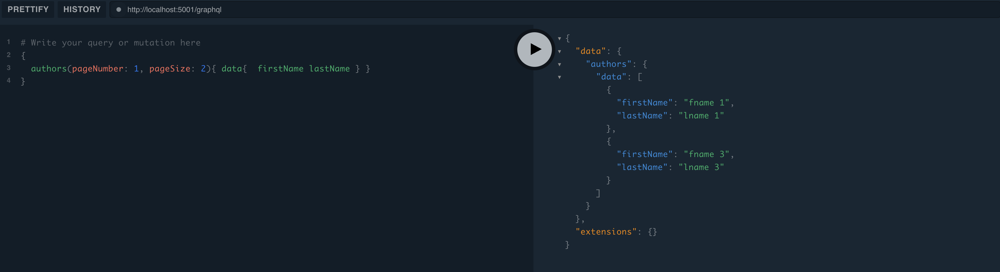

# Blogger

This project was created as an example to demonstrate the use of GraphQL.
You can find the related article on Medium via [this link](https://medium.com/@ademcatamak/what-is-graphql-2a8e554d72e6).

To run the application, make sure you have .NET 9.0 installed on your system.
If you want to run it locally, you can use the provided docker-compose file in the repository to set up the required SQL server.

When you run the application, you can access the GraphQL playground via port 5001.

```
{
  authors(pageNumber: 1, pageSize: 2){ data{  firstName lastName } }
}
```

